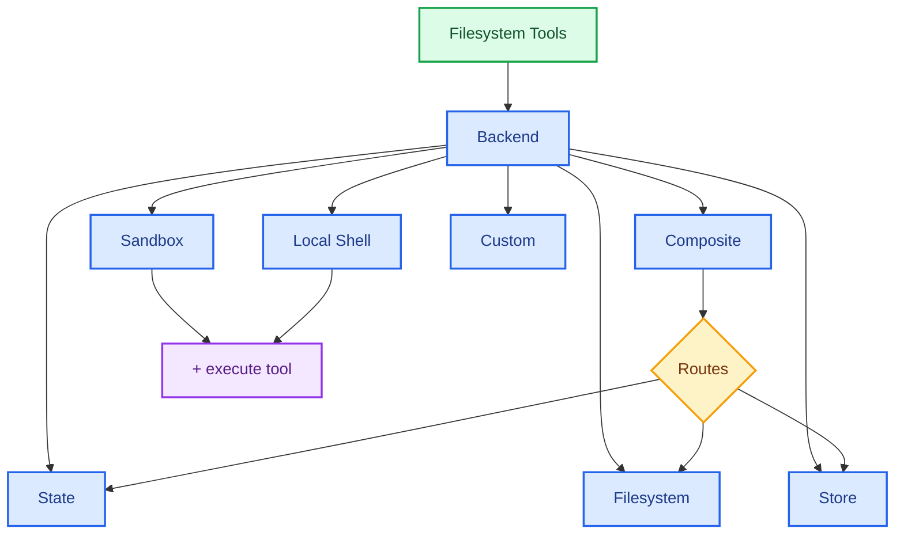

import BackendState from '/snippets/backend-state.mdx';
import BackendFilesystem from '/snippets/backend-filesystem.mdx';
import BackendLocalShell from '/snippets/backend-local-shell.mdx';
import BackendStore from '/snippets/backend-store.mdx';
import BackendComposite from '/snippets/backend-composite.mdx';

Deep Agents expose a filesystem surface to the agent via tools like `ls`, `read_file`, `write_file`, `edit_file`, `glob`, and `grep`. These tools operate through a pluggable backend. The `read_file` tool natively supports image files (`.png`, `.jpg`, `.jpeg`, `.gif`, `.webp`) across all backends, returning them as multimodal content blocks.

The `read_file` tool also supports other binary file types (PDFs, audio, and others) via MIME type detection in the v2 backend protocol. Custom backends can return binary content as a `Uint8Array` alongside a `mimeType` string.


Sandboxes and the `LocalShellBackend` also provide and `execute` tool.



This page explains how to [choose a backend](#specify-a-backend), [route different paths to different backends](#route-to-different-backends), [implement your own virtual filesystem](#use-a-virtual-filesystem) (e.g., S3 or Postgres), [add policy hooks](#add-policy-hooks), and [comply with the backend protocol](#protocol-reference).

## Quickstart

Here are a few prebuilt filesystem backends that you can quickly use with your deep agent:

| Built-in backend | Description |
|---|---|
| [Default](#statebackend-ephemeral) | `agent = create_deep_agent()` <br></br> Ephemeral in state. The default filesystem backend for an agent is stored in `langgraph` state. Note that this filesystem only persists _for a single thread_. |
| [Local filesystem persistence](#filesystembackend-local-disk) | `agent = create_deep_agent(backend=FilesystemBackend(root_dir="/Users/nh/Desktop/"))` <br></br>This gives the deep agent access to your local machine's filesystem. You can specify the root directory that the agent has access to. Note that any provided `root_dir` must be an absolute path. |
| [Durable store (LangGraph store)](#storebackend-langgraph-store) | `agent = create_deep_agent(backend=lambda rt: StoreBackend(rt))` <br></br>This gives the agent access to long-term storage that is _persisted across threads_. This is great for storing longer term memories or instructions that are applicable to the agent over multiple executions. |
| [Sandbox](/oss/javascript/deepagents/sandboxes) | `agent = create_deep_agent(backend=sandbox)` <br></br>Execute code in isolated environments. Sandboxes provide filesystem tools plus the `execute` tool for running shell commands. Choose from Modal, Daytona, Deno, or local VFS. |
| [Local shell](#localshellbackend-local-shell) | `agent = create_deep_agent(backend=LocalShellBackend(root_dir=".", env={"PATH": "/usr/bin:/bin"}))` <br></br>Filesystem and shell execution directly on the host. No isolation—use only in controlled development environments. See [security considerations](#localshellbackend-local-shell) below. |
| [Composite](#compositebackend-router) | Ephemeral by default, `/memories/` persisted. The Composite backend is maximally flexible. You can specify different routes in the filesystem to point towards different backends. See Composite routing below for a ready-to-paste example. |


## Built-in backends

### StateBackend (ephemeral)

<BackendState />

**How it works:**
- Stores files in LangGraph agent state for the current thread.
- Persists across multiple agent turns on the same thread via checkpoints.

**Best for:**
- A scratch pad for the agent to write intermediate results.
- Automatic eviction of large tool outputs which the agent can then read back in piece by piece.

Note that this backend is shared between the supervisor agent and subagents, and any files a subagent writes will remain in the LangGraph agent state
even after that subagent's execution is complete. Those files will continue to be available to the supervisor agent and other subagents.

### FilesystemBackend (local disk)

<Warning>
This backend grants agents direct filesystem read/write access.
Use with caution and only in appropriate environments.

**Appropriate use cases:**
- Local development CLIs (coding assistants, development tools)
- CI/CD pipelines (see security considerations below)

**Inappropriate use cases:**
- Web servers or HTTP APIs - use `StateBackend`, `StoreBackend`, or a [sandbox backend](/oss/javascript/deepagents/sandboxes) instead

**Security risks:**
- Agents can read any accessible file, including secrets (API keys, credentials, `.env` files)
- Combined with network tools, secrets may be exfiltrated via SSRF attacks
- File modifications are permanent and irreversible

**Recommended safeguards:**
1. Enable [Human-in-the-Loop (HITL) middleware](/oss/javascript/deepagents/human-in-the-loop) to review sensitive operations.
1. Exclude secrets from accessible filesystem paths (especially in CI/CD).
1. Use a [sandbox backend](/oss/javascript/deepagents/sandboxes) for production environments requiring filesystem interaction.
1. **Always** use `virtual_mode=True` with `root_dir` to enable path-based access restrictions (blocks `..`, `~`, and absolute paths outside root).
   Note that the default (`virtual_mode=False`) provides no security even with `root_dir` set.
</Warning>

<BackendFilesystem />

**How it works:**
- Reads/writes real files under a configurable `root_dir`.
- You can optionally set `virtual_mode=True` to sandbox and normalize paths under `root_dir`.
- Uses secure path resolution, prevents unsafe symlink traversal when possible, can use ripgrep for fast `grep`.

**Best for:**
- Local projects on your machine
- CI sandboxes
- Mounted persistent volumes

### LocalShellBackend (local shell)

<Warning>
This backend grants agents direct filesystem read/write access **and** unrestricted shell execution on your host.
Use with extreme caution and only in appropriate environments.

**Appropriate use cases:**
- Local development CLIs (coding assistants, development tools)
- Personal development environments where you trust the agent's code
- CI/CD pipelines with proper secret management

**Inappropriate use cases:**
- Production environments (such as web servers, APIs, multi-tenant systems)
- Processing untrusted user input or executing untrusted code

**Security risks:**
- Agents can execute **arbitrary shell commands** with your user's permissions
- Agents can read any accessible file, including secrets (API keys, credentials, `.env` files)
- Secrets may be exposed
- File modifications and command execution are **permanent and irreversible**
- Commands run directly on your host system
- Commands can consume unlimited CPU, memory, disk

**Recommended safeguards:**
1. Enable [Human-in-the-Loop (HITL) middleware](/oss/javascript/deepagents/human-in-the-loop) to review and approve operations before execution. This is **strongly recommended**.
2. Run in dedicated development environments only. Never use on shared or production systems.
3. Use a [sandbox backend](/oss/javascript/deepagents/sandboxes) for production environments requiring shell execution.

**Note:** `virtual_mode=True` provides no security with shell access enabled, since commands can access any path on the system.
</Warning>

<BackendLocalShell />

**How it works:**
- Extends `FilesystemBackend` with the `execute` tool for running shell commands on the host.
- Commands run directly on your machine using `subprocess.run(shell=True)` with no sandboxing.
- Supports `timeout` (default 120s), `max_output_bytes` (default 100,000), `env`, and `inherit_env` for environment variables.
- Shell commands use `root_dir` as the working directory but can access any path on the system.

**Best for:**
- Local coding assistants and development tools
- Quick iteration during development when you trust the agent

### StoreBackend (LangGraph store)

<BackendStore />

**How it works:**
- Stores files in a LangGraph [`BaseStore`](https://reference.langchain.com/javascript/langchain-core/stores/BaseStore) provided by the runtime, enabling cross‑thread durable storage.

**Best for:**
- When you already run with a configured LangGraph store (for example, Redis, Postgres, or cloud implementations behind [`BaseStore`](https://reference.langchain.com/javascript/langchain-core/stores/BaseStore)).
- When you're deploying your agent through LangSmith Deployment (a store is automatically provisioned for your agent).


### CompositeBackend (router)

<BackendComposite />

**How it works:**
- Routes file operations to different backends based on path prefix.
- Preserves the original path prefixes in listings and search results.

**Best for:**
- When you want to give your agent both ephemeral and cross-thread storage, a `CompositeBackend` allows you provide both a `StateBackend` and `StoreBackend`
- When you have multiple sources of information that you want to provide to your agent as part of a single filesystem.
    - e.g. You have long-term memories stored under `/memories/` in one Store and you also have a custom backend that has documentation accessible at /docs/.

## Specify a backend


- Pass a backend to `createDeepAgent({ backend: ... })`. The filesystem middleware uses it for all tooling.
- You can pass either:
    - An instance implementing `AnyBackendProtocol` (`BackendProtocolV1` or `BackendProtocolV2`) — for example, `new FilesystemBackend({ rootDir: "." })`, or
    - A factory `BackendFactory = (stateAndStore: StateAndStore) => AnyBackendProtocol` — for backends that need runtime context like `StateBackend` or `StoreBackend`.
- If omitted, the default is `(config) => new StateBackend(config)`.
- Pass v1 backends directly — they are adapted to v2 automatically via `adaptBackendProtocol`.


## Route to different backends

Route parts of the namespace to different backends. Commonly used to persist `/memories/*` and keep everything else ephemeral.


```typescript
import { createDeepAgent, CompositeBackend, FilesystemBackend, StateBackend } from "deepagents";

const compositeBackend = (rt) => new CompositeBackend(
  new StateBackend(rt),
  {
    "/memories/": new FilesystemBackend({ rootDir: "/deepagents/myagent", virtualMode: true }),
  },
);

const agent = createDeepAgent({ backend: compositeBackend });
```


Behavior:
- `/workspace/plan.md` → `StateBackend` (ephemeral)
- `/memories/agent.md` → `FilesystemBackend` under `/deepagents/myagent`
- `ls`, `glob`, `grep` aggregate results and show original path prefixes.

Notes:
- Longer prefixes win (for example, route `"/memories/projects/"` can override `"/memories/"`).
- For StoreBackend routing, ensure the agent runtime provides a store (`runtime.store`).

## Use a virtual filesystem

Build a custom backend to project a remote or database filesystem (e.g., S3 or Postgres) into the tools namespace.

Design guidelines:

- Paths are absolute (`/x/y.txt`). Decide how to map them to your storage keys/rows.
- Implement listing and glob efficiently (server-side filtering where available, otherwise local filter).
- For external persistence (S3, Postgres, etc.), return `files_update=None` (Python) or omit `filesUpdate` (JS) in write/edit results — only in-memory state backends need to return a files update dict.


- Use `ls` and `glob` as the method names.
- Return `{ error: "..." }` in the result object for missing files or invalid patterns (do not throw).


S3-style outline:


```typescript
import {
  type BackendProtocolV2,
  type LsResult,
  type ReadResult,
  type ReadRawResult,
  type GrepResult,
  type GlobResult,
  type WriteResult,
  type EditResult,
} from "deepagents";

class S3Backend implements BackendProtocolV2 {
  constructor(private bucket: string, private prefix: string = "") {
    this.prefix = prefix.replace(/\/$/, "");
  }

  private key(path: string): string {
    return `${this.prefix}${path}`;
  }

  async ls(path: string): Promise<LsResult> {
    // List objects under this.key(path); build FileInfo entries (path, size, modified_at)
    ...
  }

  async read(filePath: string, offset = 0, limit = 500): Promise<ReadResult> {
    // Fetch object; return { content } or { error }
    ...
  }

  async readRaw(filePath: string): Promise<ReadRawResult> {
    // Fetch raw bytes; return { data: { content, mimeType, created_at, modified_at } } or { error }
    ...
  }

  async grep(pattern: string, path?: string | null, glob?: string | null): Promise<GrepResult> {
    // Optionally filter server-side; else list and scan content
    ...
  }

  async glob(pattern: string, path = "/"): Promise<GlobResult> {
    // Apply glob relative to path across keys
    ...
  }

  async write(filePath: string, content: string): Promise<WriteResult> {
    // Enforce create-only semantics; return { path: filePath } or { error }
    ...
  }

  async edit(filePath: string, oldString: string, newString: string, replaceAll = false): Promise<EditResult> {
    // Read → replace (respect uniqueness vs replaceAll) → write → return occurrences
    ...
  }
}
```


Postgres-style outline:


- Table `files(path text primary key, content text, mime_type text, created_at timestamptz, modified_at timestamptz)`
- Map tool operations onto SQL:
  - `ls` uses `WHERE path LIKE $1 || '%'`
  - `glob` filter in SQL or fetch then apply glob in TypeScript
  - `grep` can fetch candidate rows by extension or last modified time, then scan lines (skip rows where `mime_type` is binary)


## Add policy hooks

Enforce enterprise rules by subclassing or wrapping a backend.

Block writes/edits under selected prefixes (subclass):


```typescript
import { FilesystemBackend, type WriteResult, type EditResult } from "deepagents";

class GuardedBackend extends FilesystemBackend {
  private denyPrefixes: string[];

  constructor({ denyPrefixes, ...options }: { denyPrefixes: string[]; rootDir?: string }) {
    super(options);
    this.denyPrefixes = denyPrefixes.map(p => p.endsWith("/") ? p : p + "/");
  }

  async write(filePath: string, content: string): Promise<WriteResult> {
    if (this.denyPrefixes.some(p => filePath.startsWith(p))) {
      return { error: `Writes are not allowed under ${filePath}` };
    }
    return super.write(filePath, content);
  }

  async edit(filePath: string, oldString: string, newString: string, replaceAll = false): Promise<EditResult> {
    if (this.denyPrefixes.some(p => filePath.startsWith(p))) {
      return { error: `Edits are not allowed under ${filePath}` };
    }
    return super.edit(filePath, oldString, newString, replaceAll);
  }
}
```


Generic wrapper (works with any backend):


```typescript
import {
  type BackendProtocolV2,
  type LsResult,
  type ReadResult,
  type ReadRawResult,
  type GrepResult,
  type GlobResult,
  type WriteResult,
  type EditResult,
} from "deepagents";

class PolicyWrapper implements BackendProtocolV2 {
  private denyPrefixes: string[];

  constructor(private inner: BackendProtocolV2, denyPrefixes: string[] = []) {
    this.denyPrefixes = denyPrefixes.map(p => p.endsWith("/") ? p : p + "/");
  }

  private isDenied(path: string): boolean {
    return this.denyPrefixes.some(p => path.startsWith(p));
  }

  ls(path: string): Promise<LsResult> { return this.inner.ls(path); }
  read(filePath: string, offset?: number, limit?: number): Promise<ReadResult> { return this.inner.read(filePath, offset, limit); }
  readRaw(filePath: string): Promise<ReadRawResult> { return this.inner.readRaw(filePath); }
  grep(pattern: string, path?: string | null, glob?: string | null): Promise<GrepResult> { return this.inner.grep(pattern, path, glob); }
  glob(pattern: string, path?: string): Promise<GlobResult> { return this.inner.glob(pattern, path); }

  async write(filePath: string, content: string): Promise<WriteResult> {
    if (this.isDenied(filePath)) return { error: `Writes are not allowed under ${filePath}` };
    return this.inner.write(filePath, content);
  }

  async edit(filePath: string, oldString: string, newString: string, replaceAll = false): Promise<EditResult> {
    if (this.isDenied(filePath)) return { error: `Edits are not allowed under ${filePath}` };
    return this.inner.edit(filePath, oldString, newString, replaceAll);
  }
}
```


## Protocol reference


Backends must implement `BackendProtocolV2` (imported from `deepagents`). All methods are async and return structured result objects — errors are returned in `result.error`, never thrown.

Required methods:
- `ls(path: string): Promise<LsResult>`
  - Return `{ files: FileInfo[] }` on success or `{ error }` on failure. Include `is_dir`, `size`, `modified_at` when available. Sort by `path` for deterministic output.
- `read(filePath: string, offset?: number, limit?: number): Promise<ReadResult>`
  - Return `{ content: string }` for text files (paginated by line offset/limit) or `{ content: Uint8Array, mimeType }` for binary files. Return `{ error }` on missing file.
- `readRaw(filePath: string): Promise<ReadRawResult>`
  - Return `{ data: { content, mimeType, created_at, modified_at } }` or `{ error }`. Binary files return `content` as `Uint8Array`.
- `grep(pattern: string, path?: string | null, glob?: string | null): Promise<GrepResult>`
  - Return `{ matches: GrepMatch[] }` on success or `{ error }` for invalid patterns. Binary files are skipped automatically.
- `glob(pattern: string, path?: string): Promise<GlobResult>`
  - Return `{ files: FileInfo[] }` matching the pattern (empty array if none), or `{ error }` on failure.
- `write(filePath: string, content: string): Promise<WriteResult>`
  - Create-only. Return `{ error }` on conflict. On success, return `{ path: filePath }`.
- `edit(filePath: string, oldString: string, newString: string, replaceAll?: boolean): Promise<EditResult>`
  - Enforce uniqueness of `oldString` unless `replaceAll=true`. Return `{ error }` if not found. Return `{ path, occurrences }` on success.

Supporting types:
- `LsResult`: `{ error?: string; files?: FileInfo[] }`
- `ReadResult`: `{ error?: string; content?: string | Uint8Array; mimeType?: string }`
- `GrepResult`: `{ error?: string; matches?: GrepMatch[] }`
- `GlobResult`: `{ error?: string; files?: FileInfo[] }`
- `WriteResult`: `{ error?: string; path?: string }`
- `EditResult`: `{ error?: string; path?: string; occurrences?: number }`
- `FileInfo`: `{ path: string; is_dir?: boolean; size?: number; modified_at?: string }`
- `GrepMatch`: `{ path: string; line: number; text: string }`

**Migrating from v1:** If you have an existing v1 custom backend (using `lsInfo`, `grepRaw`, `globInfo`), wrap it with `adaptBackendProtocol()`:

```typescript
import { adaptBackendProtocol } from "deepagents";

const v2Backend = adaptBackendProtocol(myV1Backend);
```

For custom sandbox backends, use `adaptSandboxProtocol()` instead.

---

<div className="source-links">
<Callout icon="edit">
    [Edit this page on GitHub](https://github.com/langchain-ai/docs/edit/main/src/oss/deepagents/backends.mdx) or [file an issue](https://github.com/langchain-ai/docs/issues/new/choose).
</Callout>
<Callout icon="terminal-2">
    [Connect these docs](/use-these-docs) to Claude, VSCode, and more via MCP for real-time answers.
</Callout>
</div>
