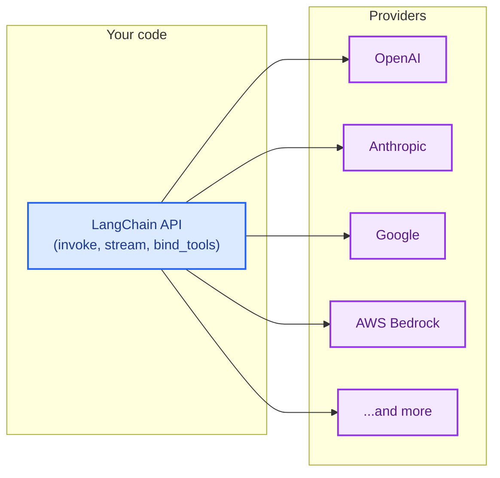

LangChain gives you a single, unified API to work with models from any provider. Install a provider package, pick a model name, and start building — the same code works whether you use OpenAI, Anthropic, Google, or any of the 20+ supported providers.



## One API for any model

Every LangChain chat model — regardless of provider — implements the same interface. This means you can:

- **Swap providers** without rewriting application logic
- **Compare models** side-by-side with identical code
- **Use advanced features** like [tool calling](/oss/python/langchain/tools), [structured output](/oss/python/langchain/structured-output), and [streaming](/oss/python/langchain/streaming) across all providers

```python
from langchain.chat_models import init_chat_model

openai_model = init_chat_model("openai:gpt-4.1")
anthropic_model = init_chat_model("anthropic:claude-sonnet-4-6")
google_model = init_chat_model("google-genai:gemini-2.5-flash")

for model in [openai_model, anthropic_model, google_model]:
    response = model.invoke("Explain quantum computing in one sentence.")
    print(response.text)
```


## What is a provider?

A **provider** is a company or platform that hosts AI models and exposes them through an API. Examples include OpenAI, Anthropic, Google, and AWS Bedrock.

In LangChain, each provider has a dedicated **integration package** (e.g., `langchain-openai`, `langchain-anthropic`) that implements the standard LangChain interface for that provider's models. This means:

- **Dedicated packages** for each provider with proper versioning and dependency management
- **Provider-specific features** are available when you need them (e.g., OpenAI's Responses API, Anthropic's extended thinking)
- **Automatic API key handling** through environment variables

```shell
pip install langchain-openai      # For OpenAI models
pip install langchain-anthropic   # For Anthropic models
pip install langchain-google-genai # For Google models
```


For a full list of provider packages, see the [integrations page](/oss/python/integrations/providers/overview).

## Find model names

Each provider supports specific model names that you pass when initializing a chat model. There are two ways to specify a model:

<CodeGroup>
```python Provider prefix format
from langchain.chat_models import init_chat_model

model = init_chat_model("openai:gpt-4.1")
```

```python Direct class instantiation
from langchain_openai import ChatOpenAI

model = ChatOpenAI(model="gpt-4.1")
```
</CodeGroup>


To find available model names for a provider, refer to the provider's own documentation:

| Provider | Where to find model names |
| :--- | :--- |
| [OpenAI](/oss/python/integrations/providers/openai) | [OpenAI models page](https://platform.openai.com/docs/models) |
| [Anthropic](/oss/python/integrations/providers/anthropic) | [Anthropic models page](https://docs.anthropic.com/en/docs/about-claude/models) |
| [Google](/oss/python/integrations/providers/google) | [Google AI models page](https://ai.google.dev/gemini-api/docs/models) |
| [AWS Bedrock](/oss/python/integrations/providers/aws) | [Bedrock supported models](https://docs.aws.amazon.com/bedrock/latest/userguide/models-supported.html) |
| [Ollama](/oss/python/integrations/providers/ollama) | [Ollama model library](https://ollama.com/library) |
| [Groq](/oss/python/integrations/providers/groq) | [Groq supported models](https://console.groq.com/docs/models) |

<Tip>
When using [`init_chat_model`](https://reference.langchain.com/python/langchain/chat_models/base/init_chat_model) with the `provider:model` format, LangChain automatically resolves the provider and loads the correct integration package. You can also omit the provider prefix if the model name is unambiguous (e.g., `"gpt-4.1"` resolves to OpenAI).
</Tip>

## Use new models immediately

Because LangChain provider packages pass model names directly to the provider's API, you can use new models the moment a provider releases them — no LangChain update required. Simply pass the new model name:

```python
model = init_chat_model("anthropic:claude-sonnet-4-6")
```


New model names work immediately as long as your provider package version supports the API version the model requires. In most cases, model releases are backward-compatible and require no package update.

## Model capabilities

Different providers and models support different features. The table below summarizes capability support across popular LangChain chat model integrations:

| Model | [Tool calling](/oss/python/langchain/tools) | [Structured output](/oss/python/langchain/structured-output) | [Multimodal](/oss/python/langchain/messages#multimodal) |
|-|-|-|-|
| [`ChatOpenAI`](/oss/python/integrations/chat/openai) | ✅ | ✅ | ✅ |
| [`ChatAnthropic`](/oss/python/integrations/chat/anthropic) | ✅ | ✅ | ✅ |
| [`ChatGoogleGenerativeAI`](/oss/python/integrations/chat/google_generative_ai) | ✅ | ✅ | ✅ |
| [`AzureChatOpenAI`](/oss/python/integrations/chat/azure_chat_openai) | ✅ | ✅ | ✅ |
| [`ChatGroq`](/oss/python/integrations/chat/groq) | ✅ | ✅ | ❌ |
| [`ChatBedrock`](/oss/python/integrations/chat/bedrock) | ✅ | ✅ | ❌ |
| [`ChatOllama`](/oss/python/integrations/chat/ollama) | ✅ | ✅ | ❌ |
| [`ChatXAI`](/oss/python/integrations/chat/xai) | ✅ | ✅ | ❌ |
| [`ChatDeepSeek`](/oss/python/integrations/chat/deepseek) | ✅ | ✅ | ❌ |
| [`ChatMistralAI`](/oss/python/integrations/chat/mistralai) | ✅ | ✅ | ❌ |
| [`ChatNVIDIA`](/oss/python/integrations/chat/nvidia_ai_endpoints) | ✅ | ✅ | ✅ |
| [`ChatCohere`](/oss/python/integrations/chat/cohere) | ✅ | ✅ | ❌ |
| [`ChatFireworks`](/oss/python/integrations/chat/fireworks) | ✅ | ✅ | ❌ |
| [`ChatTogether`](/oss/python/integrations/chat/together) | ✅ | ✅ | ❌ |
| [`ChatPerplexity`](/oss/python/integrations/chat/perplexity) | ❌ | ✅ | ✅ |

<Info>
Capability support in the table above refers to what the LangChain integration class supports. Individual models within a provider may vary. Refer to the provider's documentation for model-specific capabilities.
</Info>

For the full list of chat model integrations and their capabilities, see the [chat models integrations page](/oss/python/integrations/chat).

## Routers and proxies

**Routers** (also called proxies or gateways) give you access to models from multiple providers through a single API and credential. They can simplify billing, let you switch between models without changing integrations, and offer features like automatic fallbacks and load balancing.

| Provider | Integration | Description |
|-|-|-|
| [OpenRouter](https://openrouter.ai/) | [`ChatOpenRouter`](/oss/python/integrations/chat/openrouter) | Unified access to models from OpenAI, Anthropic, Google, Meta, and more |
| [LiteLLM](https://www.litellm.ai/) | [`ChatLiteLLM`](/oss/python/integrations/chat/litellm) | Unified interface for 100+ providers with routing, fallbacks, and spend tracking |

Routers are useful when you want to:

- **Access many providers** with a single API key and billing account
- **Switch models dynamically** without managing multiple provider credentials
- **Use fallback models** that automatically retry with a different model if the primary one fails

```python
from langchain.chat_models import init_chat_model

model = init_chat_model("openrouter:anthropic/claude-sonnet-4-6")
response = model.invoke("Hello!")
```


## OpenAI-compatible endpoints

Many providers offer endpoints compatible with OpenAI's [Chat Completions API](https://platform.openai.com/docs/api-reference/chat). You can connect to these using [`ChatOpenAI`](/oss/python/integrations/chat/openai) with a custom `base_url`:

```python
from langchain_openai import ChatOpenAI

model = ChatOpenAI(
    base_url="https://your-provider.com/v1",
    api_key="your-api-key",
    model="provider-model-name",
)
```


<Warning>
`ChatOpenAI` targets [official OpenAI API specifications](https://github.com/openai/openai-openapi) only. Non-standard response fields from third-party providers are not extracted or preserved. Use a dedicated provider package or router when you need access to non-standard features.
</Warning>

## Next steps

<CardGroup cols={2}>
    <Card title="Models guide" icon="cpu" href="/oss/python/langchain/models">
        Learn how to use models: invoke, stream, batch, tool calling, and more.
    </Card>
    <Card title="Chat model integrations" icon="message" href="/oss/python/integrations/chat">
        Browse all chat model integrations and their capabilities.
    </Card>
    <Card title="All providers" icon="grid-2" href="/oss/python/integrations/providers/overview">
        See the full list of provider packages and integrations.
    </Card>
    <Card title="Agents" icon="robot" href="/oss/python/langchain/agents">
        Build agents that use models as their reasoning engine.
    </Card>
</CardGroup>

---

<div className="source-links">
<Callout icon="edit">
    [Edit this page on GitHub](https://github.com/langchain-ai/docs/edit/main/src/oss/concepts/providers-and-models.mdx) or [file an issue](https://github.com/langchain-ai/docs/issues/new/choose).
</Callout>
<Callout icon="terminal-2">
    [Connect these docs](/use-these-docs) to Claude, VSCode, and more via MCP for real-time answers.
</Callout>
</div>
