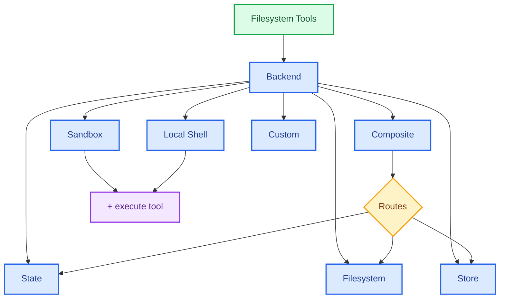

import BackendState from '/snippets/backend-state.mdx';
import BackendFilesystem from '/snippets/backend-filesystem.mdx';
import BackendLocalShell from '/snippets/backend-local-shell.mdx';
import BackendStore from '/snippets/backend-store.mdx';
import BackendComposite from '/snippets/backend-composite.mdx';

Deep Agents expose a filesystem surface to the agent via tools like `ls`, `read_file`, `write_file`, `edit_file`, `glob`, and `grep`. These tools operate through a pluggable backend. The `read_file` tool natively supports binary files (images, PDFs, audio, video) across all backends, returning a `ReadResult` with typed `content` and `mimeType`.

Sandboxes and the `LocalShellBackend` also provide and `execute` tool.



This page explains how to [choose a backend](#specify-a-backend), [route different paths to different backends](#route-to-different-backends), [implement your own virtual filesystem](#use-a-virtual-filesystem) (e.g., S3 or Postgres), [add policy hooks](#add-policy-hooks), [work with binary and multimodal files](#multimodal-and-binary-files), [comply with the backend protocol](#protocol-reference), and [update existing backends to V2](#update-existing-backends-to-v2).

## Quickstart

Here are a few prebuilt filesystem backends that you can quickly use with your deep agent:

| Built-in backend | Description |
|---|---|
| [Default](#statebackend-ephemeral) | `agent = create_deep_agent()` <br></br> Ephemeral in state. The default filesystem backend for an agent is stored in `langgraph` state. Note that this filesystem only persists _for a single thread_. |
| [Local filesystem persistence](#filesystembackend-local-disk) | `agent = create_deep_agent(backend=FilesystemBackend(root_dir="/Users/nh/Desktop/"))` <br></br>This gives the deep agent access to your local machine's filesystem. You can specify the root directory that the agent has access to. Note that any provided `root_dir` must be an absolute path. |
| [Durable store (LangGraph store)](#storebackend-langgraph-store) | `agent = create_deep_agent(backend=lambda rt: StoreBackend(rt))` <br></br>This gives the agent access to long-term storage that is _persisted across threads_. This is great for storing longer term memories or instructions that are applicable to the agent over multiple executions. |
| [Sandbox](/oss/python/deepagents/sandboxes) | `agent = create_deep_agent(backend=sandbox)` <br></br>Execute code in isolated environments. Sandboxes provide filesystem tools plus the `execute` tool for running shell commands. Choose from Modal, Daytona, Deno, or local VFS. |
| [Local shell](#localshellbackend-local-shell) | `agent = create_deep_agent(backend=LocalShellBackend(root_dir=".", env={"PATH": "/usr/bin:/bin"}))` <br></br>Filesystem and shell execution directly on the host. No isolation—use only in controlled development environments. See [security considerations](#localshellbackend-local-shell) below. |
| [Composite](#compositebackend-router) | Ephemeral by default, `/memories/` persisted. The Composite backend is maximally flexible. You can specify different routes in the filesystem to point towards different backends. See Composite routing below for a ready-to-paste example. |


## Built-in backends

### StateBackend (ephemeral)

<BackendState />

**How it works:**
- Stores files in LangGraph agent state for the current thread.
- Persists across multiple agent turns on the same thread via checkpoints.

**Best for:**
- A scratch pad for the agent to write intermediate results.
- Automatic eviction of large tool outputs which the agent can then read back in piece by piece.

Note that this backend is shared between the supervisor agent and subagents, and any files a subagent writes will remain in the LangGraph agent state
even after that subagent's execution is complete. Those files will continue to be available to the supervisor agent and other subagents.

### FilesystemBackend (local disk)

<Warning>
This backend grants agents direct filesystem read/write access.
Use with caution and only in appropriate environments.

**Appropriate use cases:**
- Local development CLIs (coding assistants, development tools)
- CI/CD pipelines (see security considerations below)

**Inappropriate use cases:**
- Web servers or HTTP APIs - use `StateBackend`, `StoreBackend`, or a [sandbox backend](/oss/python/deepagents/sandboxes) instead

**Security risks:**
- Agents can read any accessible file, including secrets (API keys, credentials, `.env` files)
- Combined with network tools, secrets may be exfiltrated via SSRF attacks
- File modifications are permanent and irreversible

**Recommended safeguards:**
1. Enable [Human-in-the-Loop (HITL) middleware](/oss/python/deepagents/human-in-the-loop) to review sensitive operations.
1. Exclude secrets from accessible filesystem paths (especially in CI/CD).
1. Use a [sandbox backend](/oss/python/deepagents/sandboxes) for production environments requiring filesystem interaction.
1. **Always** use `virtual_mode=True` with `root_dir` to enable path-based access restrictions (blocks `..`, `~`, and absolute paths outside root).
   Note that the default (`virtual_mode=False`) provides no security even with `root_dir` set.
</Warning>

<BackendFilesystem />

**How it works:**
- Reads/writes real files under a configurable `root_dir`.
- You can optionally set `virtual_mode=True` to sandbox and normalize paths under `root_dir`.
- Uses secure path resolution, prevents unsafe symlink traversal when possible, can use ripgrep for fast `grep`.

**Best for:**
- Local projects on your machine
- CI sandboxes
- Mounted persistent volumes

### LocalShellBackend (local shell)

<Warning>
This backend grants agents direct filesystem read/write access **and** unrestricted shell execution on your host.
Use with extreme caution and only in appropriate environments.

**Appropriate use cases:**
- Local development CLIs (coding assistants, development tools)
- Personal development environments where you trust the agent's code
- CI/CD pipelines with proper secret management

**Inappropriate use cases:**
- Production environments (such as web servers, APIs, multi-tenant systems)
- Processing untrusted user input or executing untrusted code

**Security risks:**
- Agents can execute **arbitrary shell commands** with your user's permissions
- Agents can read any accessible file, including secrets (API keys, credentials, `.env` files)
- Secrets may be exposed
- File modifications and command execution are **permanent and irreversible**
- Commands run directly on your host system
- Commands can consume unlimited CPU, memory, disk

**Recommended safeguards:**
1. Enable [Human-in-the-Loop (HITL) middleware](/oss/python/deepagents/human-in-the-loop) to review and approve operations before execution. This is **strongly recommended**.
2. Run in dedicated development environments only. Never use on shared or production systems.
3. Use a [sandbox backend](/oss/python/deepagents/sandboxes) for production environments requiring shell execution.

**Note:** `virtual_mode=True` provides no security with shell access enabled, since commands can access any path on the system.
</Warning>

<BackendLocalShell />

**How it works:**
- Extends `FilesystemBackend` with the `execute` tool for running shell commands on the host.
- Commands run directly on your machine using `subprocess.run(shell=True)` with no sandboxing.
- Supports `timeout` (default 120s), `max_output_bytes` (default 100,000), `env`, and `inherit_env` for environment variables.
- Shell commands use `root_dir` as the working directory but can access any path on the system.

**Best for:**
- Local coding assistants and development tools
- Quick iteration during development when you trust the agent

### StoreBackend (LangGraph store)

<BackendStore />

**How it works:**
- Stores files in a LangGraph [`BaseStore`](https://reference.langchain.com/python/langchain-core/stores/BaseStore) provided by the runtime, enabling cross‑thread durable storage.

**Best for:**
- When you already run with a configured LangGraph store (for example, Redis, Postgres, or cloud implementations behind [`BaseStore`](https://reference.langchain.com/python/langchain-core/stores/BaseStore)).
- When you're deploying your agent through LangSmith Deployment (a store is automatically provisioned for your agent).


### CompositeBackend (router)

<BackendComposite />

**How it works:**
- Routes file operations to different backends based on path prefix.
- Preserves the original path prefixes in listings and search results.

**Best for:**
- When you want to give your agent both ephemeral and cross-thread storage, a `CompositeBackend` allows you provide both a `StateBackend` and `StoreBackend`
- When you have multiple sources of information that you want to provide to your agent as part of a single filesystem.
    - e.g. You have long-term memories stored under `/memories/` in one Store and you also have a custom backend that has documentation accessible at /docs/.

## Specify a backend

- Pass a backend to `create_deep_agent(backend=...)`. The filesystem middleware uses it for all tooling.
- You can pass either:
    - An instance implementing `BackendProtocolV2` (for example, `FilesystemBackend(root_dir=".")`), or
    - A `BackendFactory` function `(stateAndStore: StateAndStore) => BackendProtocolV2` (for backends that need runtime state or a store, like `StateBackend` or `StoreBackend`).
- If omitted, the default is `lambda rt: StateBackend(rt)`.

<Note>
V1 backends (implementing the deprecated `BackendProtocol`) are still accepted and automatically adapted to V2 at runtime via `adaptBackendProtocol()`. No code changes are required to keep using existing V1 backends.
</Note>


## Route to different backends

Route parts of the namespace to different backends. Commonly used to persist `/memories/*` and keep everything else ephemeral.

```python
from deepagents import create_deep_agent
from deepagents.backends import CompositeBackend, StateBackend, FilesystemBackend

composite_backend = lambda rt: CompositeBackend(
    default=StateBackend(rt),
    routes={
        "/memories/": FilesystemBackend(root_dir="/deepagents/myagent", virtual_mode=True),
    },
)

agent = create_deep_agent(backend=composite_backend)
```


Behavior:
- `/workspace/plan.md` → `StateBackend` (ephemeral)
- `/memories/agent.md` → `FilesystemBackend` under `/deepagents/myagent`
- `ls`, `glob`, `grep` aggregate results and show original path prefixes.

Notes:
- Longer prefixes win (for example, route `"/memories/projects/"` can override `"/memories/"`).
- For StoreBackend routing, ensure the agent runtime provides a store (`runtime.store`).

## Use a virtual filesystem

Build a custom backend to project a remote or database filesystem (e.g., S3 or Postgres) into the tools namespace.

Design guidelines:

- Paths are absolute (`/x/y.txt`). Decide how to map them to your storage keys/rows.
- Implement `ls` and `glob` efficiently (server-side listing where available, otherwise local filter).
- All query methods (`ls`, `read`, `readRaw`, `grep`, `glob`) must return structured Result objects (e.g., `LsResult`, `ReadResult`) with an optional `error` field.
- Support binary files in `read()` by returning `Uint8Array` content with the appropriate `mimeType`.
- For external persistence, set `files_update=None` in results; only in-state backends should return a `files_update` dict.

S3-style outline:


Postgres-style outline:

- Table `files(path text primary key, content text, created_at timestamptz, modified_at timestamptz)`
- Map tool operations onto SQL:
  - `ls` uses `WHERE path LIKE $1 || '%'` → return `LsResult`
  - `glob` filter in SQL or fetch then apply glob locally → return `GlobResult`
  - `grep` can fetch candidate rows by extension or last modified time, then scan lines → return `GrepResult`

## Add policy hooks

Enforce enterprise rules by subclassing or wrapping a backend.

Block writes/edits under selected prefixes (subclass):

```python
from deepagents.backends.filesystem import FilesystemBackend
from deepagents.backends.protocol import WriteResult, EditResult

class GuardedBackend(FilesystemBackend):
    def __init__(self, *, deny_prefixes: list[str], **kwargs):
        super().__init__(**kwargs)
        self.deny_prefixes = [p if p.endswith("/") else p + "/" for p in deny_prefixes]

    def write(self, file_path: str, content: str) -> WriteResult:
        if any(file_path.startswith(p) for p in self.deny_prefixes):
            return WriteResult(error=f"Writes are not allowed under {file_path}")
        return super().write(file_path, content)

    def edit(self, file_path: str, old_string: str, new_string: str, replace_all: bool = False) -> EditResult:
        if any(file_path.startswith(p) for p in self.deny_prefixes):
            return EditResult(error=f"Edits are not allowed under {file_path}")
        return super().edit(file_path, old_string, new_string, replace_all)
```


Generic wrapper (works with any backend):


## Multimodal and binary files

V2 backends support binary files natively. When `read()` encounters a binary file (determined by MIME type from the file extension), it returns a `ReadResult` with `Uint8Array` content and the corresponding `mimeType`. Text files return `string` content.

### Supported MIME types

| Category | Extensions | MIME types |
|----------|-----------|------------|
| Images | `.png`, `.jpg`/`.jpeg`, `.gif`, `.webp`, `.svg`, `.heic`, `.heif` | `image/png`, `image/jpeg`, `image/gif`, `image/webp`, `image/svg+xml`, `image/heic`, `image/heif` |
| Audio | `.mp3`, `.wav`, `.aiff`, `.aac`, `.ogg`, `.flac` | `audio/mpeg`, `audio/wav`, `audio/aiff`, `audio/aac`, `audio/ogg`, `audio/flac` |
| Video | `.mp4`, `.webm`, `.mpeg`/`.mpg`, `.mov`, `.avi`, `.flv`, `.wmv`, `.3gpp` | `video/mp4`, `video/webm`, `video/mpeg`, `video/quicktime`, `video/x-msvideo`, `video/x-flv`, `video/x-ms-wmv`, `video/3gpp` |
| Documents | `.pdf`, `.ppt`, `.pptx` | `application/pdf`, `application/vnd.ms-powerpoint`, `application/vnd.openxmlformats-officedocument.presentationml.presentation` |
| Text | `.txt`, `.html`, `.json`, `.js`, `.ts`, `.py`, etc. | `text/plain`, `text/html`, `application/json`, etc. |

### Reading binary files


### FileData format

`FileData` is the type used to store file content in state and store backends.

```typescript
type FileData =
  // Current format
  | {
      content: string | Uint8Array; // string for text, Uint8Array for binary
      mimeType: string;             // e.g. "text/plain", "image/png"
      created_at: string;           // ISO 8601 timestamp
      modified_at: string;          // ISO 8601 timestamp
    }
  // Legacy format
  | {
      content: string[];   // array of lines
      created_at: string;  // ISO 8601 timestamp
      modified_at: string; // ISO 8601 timestamp
    };
```

Backends may encounter either format when reading from state or store. The framework handles both transparently. New writes default to the current file format (v2). During rolling deployments where older readers need the legacy format, pass `fileFormat: "v1"` to the backend constructor (e.g., `new StoreBackend(rt, { fileFormat: "v1" })`).

## Protocol reference

Backends implement `BackendProtocolV2`. All query methods return structured Result objects with `{ error?: string, ...data }`.

### Required methods

- **`ls(path: string) → LsResult`**
  - List files and directories in the specified directory (non-recursive).
  - Directories have a trailing `/` in their path and `is_dir=true`.
  - Return entries with at least `path`. Include `is_dir`, `size`, `modified_at` when available.

- **`read(filePath: string, offset?: number, limit?: number) → ReadResult`**
  - Read file content. For text files, content is paginated by line offset/limit (default offset 0, limit 500). For binary files, the full raw `Uint8Array` content is returned with the `mimeType` field set.
  - On missing file, return `{ error: "File '/x' not found" }`.

- **`readRaw(filePath: string) → ReadRawResult`**
  - Read file content as raw `FileData`. Returns the full file data including timestamps.

- **`grep(pattern: string, path?: string | null, glob?: string | null) → GrepResult`**
  - Search file contents for a literal text pattern. Binary files (determined by MIME type) are skipped.
  - Return structured `GrepMatch` entries. On failure, return `{ error: "..." }`.

- **`glob(pattern: string, path?: string) → GlobResult`**
  - Return files matching a glob pattern as `FileInfo` entries.

- **`write(filePath: string, content: string) → WriteResult`**
  - Create-only semantics. On conflict, return `{ error: "..." }`. On success, set `path` and for state backends set `filesUpdate={...}`; external backends should use `filesUpdate=null`.

- **`edit(filePath: string, oldString: string, newString: string, replaceAll?: boolean) → EditResult`**
  - Enforce uniqueness of `oldString` unless `replaceAll=true`. If not found, return error. Include `occurrences` on success.

### Optional methods

- **`uploadFiles(files: Array<[string, Uint8Array]>) → FileUploadResponse[]`** — Upload multiple files (for sandbox backends).
- **`downloadFiles(paths: string[]) → FileDownloadResponse[]`** — Download multiple files (for sandbox backends).

### Result types

| Type | Success fields | Error field |
|------|----------------|-------------|
| `ReadResult` | `content?: string \| Uint8Array`, `mimeType?: string` | `error` |
| `ReadRawResult` | `data: FileData` | `error` |
| `LsResult` | `files: FileInfo[]` | `error` |
| `GlobResult` | `files: FileInfo[]` | `error` |
| `GrepResult` | `matches: GrepMatch[]` | `error` |
| `WriteResult` | `path: string`, `filesUpdate`, `metadata` | `error` |
| `EditResult` | `path: string`, `filesUpdate`, `occurrences: number`, `metadata` | `error` |

### Supporting types

- **`FileInfo`** — `path` (required), optionally `is_dir`, `size`, `modified_at`.
- **`GrepMatch`** — `path`, `line` (1-indexed), `text`.
- **`FileData`** — File content with timestamps. See [FileData format](#filedata-format).
- **`ExecuteResponse`** — `output`, `exitCode`, `truncated`.

### Sandbox extension

`SandboxBackendProtocolV2` extends `BackendProtocolV2` with:

- **`execute(command: string) → ExecuteResponse`** — Run a shell command in the sandbox.
- **`readonly id: string`** — Unique identifier for the sandbox instance.

Use the `isSandboxBackend()` type guard to check if a backend supports execution.

## Update existing backends to V2

<Accordion title="Migration guide">

### Method renames

| V1 method | V2 method | Return type change |
|-----------|-----------|-------------------|
| `lsInfo(path)` | `ls(path)` | `FileInfo[]` → `LsResult` |
| `read(filePath, offset, limit)` | `read(filePath, offset, limit)` | `string` → `ReadResult` |
| `readRaw(filePath)` | `readRaw(filePath)` | `FileData` → `ReadRawResult` |
| `grepRaw(pattern, path, glob)` | `grep(pattern, path, glob)` | `GrepMatch[] \| string` → `GrepResult` |
| `globInfo(pattern, path)` | `glob(pattern, path)` | `FileInfo[]` → `GlobResult` |
| `write(...)` | `write(...)` | Unchanged (`WriteResult`) |
| `edit(...)` | `edit(...)` | Unchanged (`EditResult`) |

### Type renames

| V1 type | V2 type |
|---------|---------|
| `BackendProtocol` | `BackendProtocolV2` |
| `SandboxBackendProtocol` | `SandboxBackendProtocolV2` |

### Adaptation utilities

If you have existing V1 backends that you need to use with V2-only code, use the adaptation functions:


<Note>
The framework auto-adapts V1 backends passed to `createDeepAgent()`. Manual adaptation is only needed when calling protocol methods directly.
</Note>

</Accordion>

---

<div className="source-links">
<Callout icon="edit">
    [Edit this page on GitHub](https://github.com/langchain-ai/docs/edit/main/src/oss/deepagents/backends.mdx) or [file an issue](https://github.com/langchain-ai/docs/issues/new/choose).
</Callout>
<Callout icon="terminal-2">
    [Connect these docs](/use-these-docs) to Claude, VSCode, and more via MCP for real-time answers.
</Callout>
</div>
