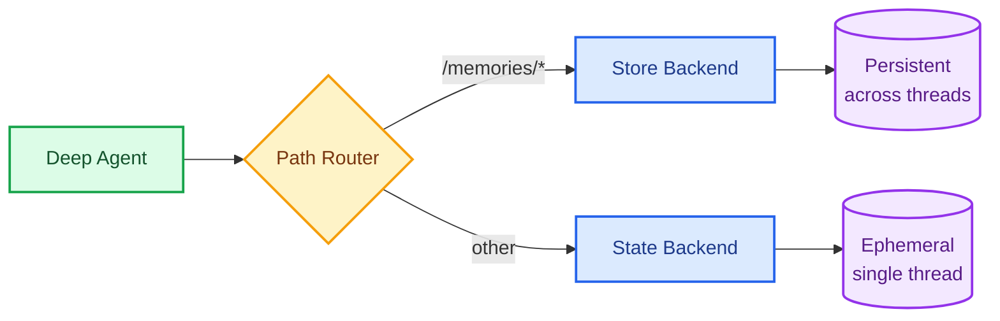

Deep Agents use their filesystem to store and retrieve information. How long that information lasts depends on which [backend](/oss/python/deepagents/backends) you configure.

## Short-term memory

By default, the agent's filesystem uses `StateBackend`, which stores files in the LangGraph thread state. Files persist across turns within a single conversation but are lost when the conversation ends.

This is useful for scratch work — drafts, intermediate results, working notes — that the agent doesn't need to remember later.

```python
from deepagents import create_deep_agent

# StateBackend is the default — no configuration needed
agent = create_deep_agent()
```


## Long-term memory

To persist information across conversations — user preferences, learned instructions, project context — use a `CompositeBackend` that routes `/memories/` to a `StoreBackend`. The agent's scratch files stay ephemeral while anything written to `/memories/` persists in a LangGraph [Store](/langsmith/custom-store).

### Setup
You can extend Deep Agents with **long-term memory** by using a [`CompositeBackend`](https://reference.langchain.com/python/deepagents/backends/composite/CompositeBackend) that routes specific paths to persistent storage. This enables hybrid storage where some files persist across threads while others remain ephemeral.



## Setup

Configure long-term memory by using a `CompositeBackend` that routes the `/memories/` path to a [`StoreBackend`](https://reference.langchain.com/python/deepagents/backends/store/StoreBackend):

```python
from deepagents import create_deep_agent
from deepagents.backends import CompositeBackend, StateBackend, StoreBackend
from langgraph.store.memory import InMemoryStore
from langgraph.checkpoint.memory import MemorySaver

checkpointer = MemorySaver()

def make_backend(runtime):
    return CompositeBackend(
        default=StateBackend(runtime),  # Short-term: ephemeral scratch space
        routes={
            "/memories/": StoreBackend(
                runtime,
                namespace=lambda ctx: (ctx.runtime.context.user_id,),
            )  # Long-term: persists across conversations
        }
    )

agent = create_deep_agent(
    store=InMemoryStore(),  # Good for local dev; omit for LangSmith Deployment
    backend=make_backend,
    checkpointer=checkpointer
)
```


### Namespace scoping

The `namespace` parameter on `StoreBackend` controls who can see what data. See [namespace factories](/oss/python/deepagents/backends#namespace-factories) for the full API.

| Scope | Who shares data | Use case |
|---|---|---|
| **Per-user** (most common) | Only that user, across all conversations | Personal preferences, instructions |
| **Per-assistant** | All users of the same assistant | Shared team knowledge |

For [deployed](/oss/python/deepagents/going-to-production) agents, always set a namespace factory to isolate data.

### Cross-thread persistence

Files in `/memories/` can be accessed from any thread:

```python
import uuid

# Thread 1: Write to long-term memory
config1 = {"configurable": {"thread_id": str(uuid.uuid4())}}
agent.invoke({
    "messages": [{"role": "user", "content": "Save my preferences to /memories/preferences.txt"}]
}, config=config1)

# Thread 2: Read from long-term memory (different conversation!)
config2 = {"configurable": {"thread_id": str(uuid.uuid4())}}
agent.invoke({
    "messages": [{"role": "user", "content": "What are my preferences?"}]
}, config=config2)
# Agent can read /memories/preferences.txt from the first thread
```


### Path routing

The `CompositeBackend` routes file operations based on path prefixes:
- Files with paths starting with `/memories/` are stored in the Store (persistent)
- Files without this prefix remain in transient state
- All filesystem tools (`ls`, `read_file`, `write_file`, `edit_file`) work with both

```python
# Short-term file (lost after conversation ends)
agent.invoke({
    "messages": [{"role": "user", "content": "Write draft to /draft.txt"}]
})

# Long-term file (survives across conversations)
agent.invoke({
    "messages": [{"role": "user", "content": "Save final report to /memories/report.txt"}]
})
```


<Note>
    `CompositeBackend` strips the route prefix before storing. For example, `/memories/preferences.txt` is stored as `/preferences.txt` in the `StoreBackend`. The agent always uses the full path. See [CompositeBackend](/oss/python/deepagents/backends#compositebackend-router) for details.
</Note>

## Accessing memories from external code

If deploying your agent on [LangSmith Deployment](/langsmith/deployment), you can read or write memories from server-side code (outside the agent) using the [Store API](/langsmith/custom-store). The namespace you use must match the one configured in your `StoreBackend` [namespace factory](/oss/python/deepagents/backends#namespace-factories). The examples below use the default legacy namespace `(assistant_id, "filesystem")`.

```python
from langgraph_sdk import get_client

client = get_client(url="<DEPLOYMENT_URL>")

# Read a memory file (path without /memories/ prefix)
item = await client.store.get_item(
    (assistant_id, "filesystem"),
    "/preferences.txt"
)

# Write a memory file
await client.store.put_item(
    (assistant_id, "filesystem"),
    "/preferences.txt",
    {
        "content": ["line 1", "line 2"],
        "created_at": "2024-01-15T10:30:00Z",
        "modified_at": "2024-01-15T10:30:00Z"
    }
)

# Search for items
items = await client.store.search_items(
    (assistant_id, "filesystem")
)
```


<Note>
    When using `CompositeBackend`, the key does not include the `/memories/` prefix because the route prefix is stripped before storing. See [Path routing](#path-routing) for details.
</Note>

For more information, see the [Store API reference](/langsmith/custom-store).

## Use cases

<Note>
    The examples below omit the `namespace` parameter for brevity. In production, always set a [namespace factory](/oss/python/deepagents/backends#namespace-factories) on `StoreBackend` to isolate data per user or tenant.
</Note>

### User preferences

Store user preferences that persist across sessions:

```python
agent = create_deep_agent(
    store=InMemoryStore(),
    backend=lambda rt: CompositeBackend(
        default=StateBackend(rt),
        routes={"/memories/": StoreBackend(rt)}
    ),
    system_prompt="""When users tell you their preferences, save them to
    /memories/user_preferences.txt so you remember them in future conversations."""
)
```


### Self-improving instructions

An agent can update its own instructions based on feedback:

```python
agent = create_deep_agent(
    store=InMemoryStore(),
    backend=lambda rt: CompositeBackend(
        default=StateBackend(rt),
        routes={"/memories/": StoreBackend(rt)}
    ),
    system_prompt="""You have a file at /memories/instructions.txt with additional
    instructions and preferences.

    Read this file at the start of conversations to understand user preferences.

    When users provide feedback like "please always do X" or "I prefer Y",
    update /memories/instructions.txt using the edit_file tool."""
)
```


Over time, the instructions file accumulates user preferences, helping the agent improve.

### Knowledge base

Build up knowledge over multiple conversations:

```python
# Conversation 1: Learn about a project
agent.invoke({
    "messages": [{"role": "user", "content": "We're building a web app with React. Save project notes."}]
})

# Conversation 2: Use that knowledge
agent.invoke({
    "messages": [{"role": "user", "content": "What framework are we using?"}]
})
# Agent reads /memories/project_notes.txt from previous conversation
```


### Research projects

Maintain research state across sessions:

```python
research_agent = create_deep_agent(
    store=InMemoryStore(),
    backend=lambda rt: CompositeBackend(
        default=StateBackend(rt),
        routes={"/memories/": StoreBackend(rt)}
    ),
    system_prompt="""You are a research assistant.

    Save your research progress to /memories/research/:
    - /memories/research/sources.txt - List of sources found
    - /memories/research/notes.txt - Key findings and notes
    - /memories/research/report.md - Final report draft

    This allows research to continue across multiple sessions."""
)
```


## Store implementations

Any LangGraph `BaseStore` implementation works. When deploying to [LangSmith Deployment](/langsmith/deployment), the platform provisions a store automatically — you don't need to configure one yourself.

### InMemoryStore (development)

Good for testing and development, but data is lost on restart:

```python
from langgraph.store.memory import InMemoryStore

store = InMemoryStore()
agent = create_deep_agent(
    store=store,
    backend=lambda rt: CompositeBackend(
        default=StateBackend(rt),
        routes={"/memories/": StoreBackend(rt)}
    )
)
```


### PostgresStore (production)

For production, use a persistent store:

```python
from langgraph.store.postgres import PostgresStore
import os

# Use PostgresStore.from_conn_string as a context manager
store_ctx = PostgresStore.from_conn_string(os.environ["DATABASE_URL"])
store = store_ctx.__enter__()
store.setup()

agent = create_deep_agent(
    store=store,
    backend=lambda rt: CompositeBackend(
        default=StateBackend(rt),
        routes={"/memories/": StoreBackend(rt)}
    )
)
```


<Accordion title="FileData schema">

Files stored via `StoreBackend` use the following schema:

```python
{
    "content": ["line 1", "line 2", "line 3"],  # List of strings (one per line)
    "created_at": "2024-01-15T10:30:00Z",       # ISO 8601 timestamp
    "modified_at": "2024-01-15T11:45:00Z"       # ISO 8601 timestamp
}
```

You can use the `create_file_data` helper to create properly formatted file data:

```python
from deepagents.backends.utils import create_file_data

file_data = create_file_data("Hello\nWorld")
# {'content': ['Hello', 'World'], 'created_at': '...', 'modified_at': '...'}
```


For more details on backend protocols, see [Backends](/oss/python/deepagents/backends#protocol-reference).

</Accordion>

## Best practices

### Use descriptive paths

Organize persistent files with clear paths:

```
/memories/user_preferences.txt
/memories/research/topic_a/sources.txt
/memories/research/topic_a/notes.txt
/memories/project/requirements.md
```

### Document the memory structure

Tell the agent what's stored where in your system prompt:

```
Your persistent memory structure:
- /memories/preferences.txt: User preferences and settings
- /memories/context/: Long-term context about the user
- /memories/knowledge/: Facts and information learned over time
```

### Prune old data

Implement periodic cleanup of outdated persistent files to keep storage manageable.

### Choose the right storage

- **Development**: Use `InMemoryStore` for quick iteration
- **Production**: Use `PostgresStore` or other persistent stores
- **Multi-tenant**: Set a [namespace factory](/oss/python/deepagents/backends#namespace-factories) on `StoreBackend` to isolate data per user (for example, `namespace=lambda ctx: (ctx.runtime.context.user_id,)`)

---

<div className="source-links">
<Callout icon="edit">
    [Edit this page on GitHub](https://github.com/langchain-ai/docs/edit/main/src/oss/deepagents/long-term-memory.mdx) or [file an issue](https://github.com/langchain-ai/docs/issues/new/choose).
</Callout>
<Callout icon="terminal-2">
    [Connect these docs](/use-these-docs) to Claude, VSCode, and more via MCP for real-time answers.
</Callout>
</div>
