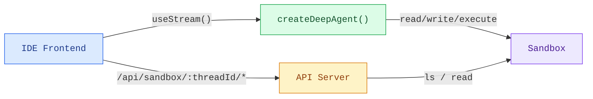
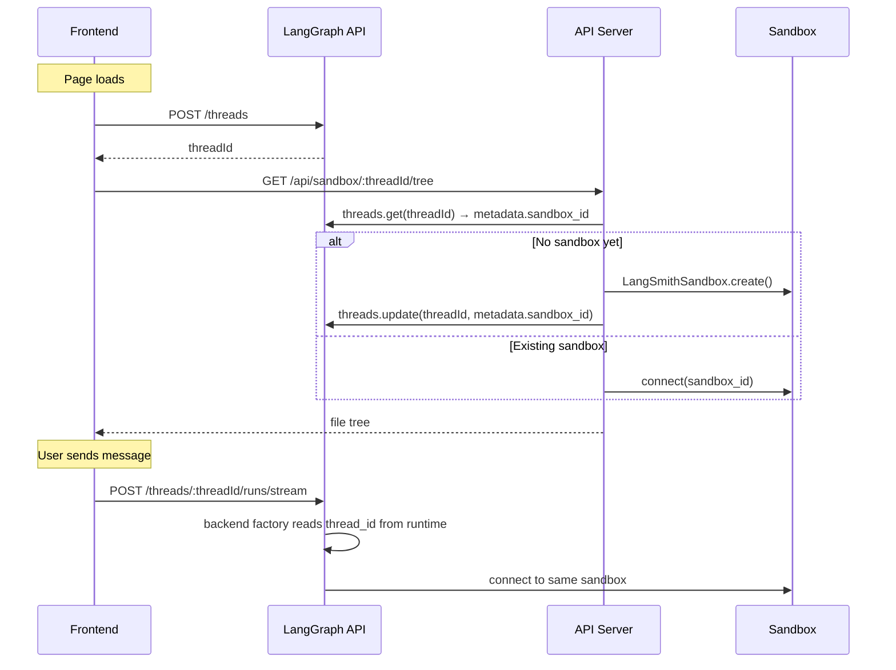

Coding agents need more than a chat window. They need a file browser, a code
viewer, and a diff panel, an IDE experience. This pattern connects a deep
agent to a [sandbox](/oss/deepagents/sandboxes) so it can read,
write, and execute code in an isolated environment, then exposes the sandbox
filesystem through a custom API server so the frontend can display files in
real time as the agent works.

import { PatternEmbed } from "/snippets/pattern-embed.jsx";

<PatternEmbed pattern="deep-agent-ide" minHeight={700} />

## Architecture

The sandbox pattern has three layers:

1. **Deep agent with sandbox backend:** The agent gets filesystem tools
   (`read_file`, `write_file`, `edit_file`, `execute`) automatically from the
   sandbox

:::python

2. **Custom API server** — A FastAPI app exposed via `langgraph.json`'s `http.app`
   field, providing file browsing endpoints the frontend can call

:::

:::js

2. **Custom API server:** A Hono app exposed via `langgraph.json`'s `http.app`
   field, providing file browsing endpoints the frontend can call

:::

3. **IDE frontend:** A three-panel layout (file tree, code/diff viewer, chat)
   that syncs files in real time as the agent makes changes



## Sandbox lifecycle

Before diving into the code, it's important to understand how sandboxes are
scoped. The scoping strategy determines who shares a sandbox, how long it
lives, and how it's resolved at runtime.

### Thread-scoped sandbox (recommended)

Each LangGraph thread gets its own sandbox. The sandbox ID is stored in the
thread's metadata and resolved via the backend factory's `runtime.configurable.thread_id`.
This is the recommended approach for most applications:

- Conversations are isolated — file changes in one thread don't affect another
- Sandbox state persists across page reloads (same thread = same sandbox)
- Cleanup is straightforward: when a thread is deleted, its sandbox can be too



### Agent-scoped sandbox

All threads under the same assistant share a single sandbox. Useful for
persistent project environments where you want changes to carry across
conversations:

:::python

```python
def sandbox_backend_factory(runtime):
    assistant_id = runtime.config.get("configurable", {}).get("assistant_id")
    return get_or_create_sandbox_for_assistant(assistant_id)
```

:::

:::js

```ts
const sandboxBackendFactory = async (runtime: BackendRuntime) => {
  const assistantId = runtime.configurable?.assistant_id;
  return getOrCreateSandboxForAssistant(assistantId);
};
```

:::

### User-scoped sandbox

Each user gets their own sandbox across all threads. Requires custom
authentication and user identification:

:::python

```python
def sandbox_backend_factory(runtime):
    user_id = runtime.config.get("configurable", {}).get("user_id")
    return get_or_create_sandbox_for_user(user_id)
```

:::

:::js

```ts
const sandboxBackendFactory = async (runtime: BackendRuntime) => {
  const userId = runtime.configurable?.user_id;
  return getOrCreateSandboxForUser(userId);
};
```

:::

### Session-scoped sandbox (client-side)

For simpler apps without LangGraph threads, the frontend can generate a
session ID and pass it directly. This approach doesn't persist across
browser sessions and is best for demos or prototyping:

:::python

```python
import uuid
import urllib.parse
import urllib.request

session_id = str(uuid.uuid4())
query = urllib.parse.urlencode({"sessionId": session_id})
urllib.request.urlopen(f"http://localhost:2024/api/sandbox/tree?{query}")
```

:::

:::js

```ts
const sessionId = crypto.randomUUID();
fetch(`/api/sandbox/tree?sessionId=${sessionId}`);
```

:::

The rest of this guide uses **thread-scoped sandboxes** as the primary example.

## Setting up the agent

### Choose a sandbox provider

:::python

Deep Agents supports multiple [sandbox providers](/oss/integrations/sandboxes). Any provider that implements the `SandboxBackendProtocol` works:

```python
from deepagents import create_deep_agent
from deepagents.sandbox import LangSmithSandbox  # or DaytonaSandbox, etc.

sandbox = LangSmithSandbox.create()
agent = create_deep_agent(model="anthropic:claude-sonnet-4-5", backend=sandbox)
```

:::

:::js

Deep Agents supports multiple sandbox providers. Any provider that implements the `SandboxBackendProtocol` works:

```ts
import { createDeepAgent, LangSmithSandbox } from "deepagents";

const sandbox = await LangSmithSandbox.create();

export const agent = createDeepAgent({
  model: "anthropic:claude-sonnet-4-5",
  backend: sandbox,
  systemPrompt: "You are an expert developer working on a project in /app.",
});
```

:::

The agent automatically gets filesystem tools (`read_file`, `write_file`,
`edit_file`, `ls`, `glob`, `grep`) and an `execute` tool for running shell
commands. No tool configuration needed.

### Use a backend factory for thread-scoped sandboxes

Instead of creating a sandbox at module level (which would be shared across
:::python
all threads and may expire), use a **backend factory** that resolves the
:::
:::js
all threads and may expire), use a [**backend factory**](https://reference.langchain.com/javascript/deepagents/index/BackendFactory) that resolves the
::::
sandbox per-thread at runtime. The factory receives a `BackendRuntime` object
with `configurable.thread_id` from the current LangGraph run:

:::js

```ts
import { createDeepAgent, LangSmithSandbox, type BackendRuntime } from "deepagents";

async function getOrCreateSandboxForThread(threadId: string): Promise<LangSmithSandbox> {
  // Check thread metadata for existing sandbox_id
  const client = new Client({ apiUrl: "http://localhost:2024" });
  const thread = await client.threads.get(threadId);
  const sandboxId = thread.metadata?.sandbox_id;

  if (sandboxId) {
    // Reconnect to existing sandbox
    return new LangSmithSandbox({
      sandbox: await new SandboxClient().getSandbox(sandboxId),
    });
  }

  // Create new sandbox and store ID in thread metadata
  const sandbox = await LangSmithSandbox.create({ templateName: "my-template" });
  await seedSandbox(sandbox);
  await client.threads.update(threadId, { metadata: { sandbox_id: sandbox.id } });
  return sandbox;
}

const sandboxBackendFactory = async (runtime: BackendRuntime) => {
  const threadId = runtime.configurable?.thread_id;
  if (!threadId) throw new Error("No thread_id — agent must run on a thread");
  return getOrCreateSandboxForThread(threadId);
};

export const agent = createDeepAgent({
  model: "anthropic:claude-sonnet-4-5",
  backend: sandboxBackendFactory,
  systemPrompt: "You are an expert developer working on a project in /app.",
});
```

:::

:::python

```python
from deepagents import create_deep_agent
from deepagents.sandbox import LangSmithSandbox

def sandbox_backend_factory(runtime):
    thread_id = runtime.config.get("configurable", {}).get("thread_id")
    if not thread_id:
        raise ValueError("No thread_id — agent must run on a thread")
    return get_or_create_sandbox_for_thread(thread_id)

agent = create_deep_agent(
    model="anthropic:claude-sonnet-4-5",
    backend=sandbox_backend_factory,
)
```

:::

### Seed the sandbox

Before the agent runs, populate the sandbox with your project files using
`uploadFiles`:

<Info>
  For **LangSmith** sandboxes, the container image and resource limits come from a
  [sandbox template](/langsmith/sandbox-templates). Pass `templateName` when creating
:::python
  the sandbox (see `get_or_create_sandbox_for_thread` above). `upload_files` seeds or updates
:::
:::js
  the sandbox (see `getOrCreateSandboxForThread` above). `uploadFiles` seeds or updates
:::
  project files at runtime on top of that image.
</Info>

```ts
const SEED_FILES: Record<string, string> = {
  "package.json": JSON.stringify({ name: "my-app", version: "1.0.0" }, null, 2),
  "src/index.js": 'console.log("Hello");',
};

const encoder = new TextEncoder();
await sandbox.uploadFiles(
  Object.entries(SEED_FILES).map(([path, content]) => [`/app/${path}`, encoder.encode(content)]),
);
```

<Tip>
  Run `sandbox.execute("cd /app && npm install")` after uploading `package.json` to install
  dependencies before the agent starts.
</Tip>

## Adding the file browsing API

:::js

The agent can read and write files, but the frontend also needs direct access to
browse the sandbox filesystem. Add a custom [Hono](https://hono.dev) API server
and expose it through the `http.app` field in `langgraph.json`.

:::

:::python

The agent can read and write files, but the frontend also needs direct access to
browse the sandbox filesystem. Add a custom [FastAPI](https://fastapi.tiangolo.com) API server
and expose it through the `http.app` field in `langgraph.json`.

:::

### Create the API server

The sandbox API endpoints use the thread ID as a URL path parameter. This
ensures the frontend always accesses the correct sandbox for the current
:::python
conversation, using the same `get_or_create_sandbox_for_thread` function as the
:::
:::js
conversation, using the same `getOrCreateSandboxForThread` function as the
:::
agent's backend factory:

:::js

```ts
// src/api/app.ts
import { Hono } from "hono";
import { getOrCreateSandboxForThread } from "./utils.js";

export const app = new Hono();

app.get("/api/sandbox/:threadId/tree", async (c) => {
  const threadId = c.req.param("threadId");
  const rootPath = c.req.query("filePath") || "/app";

  const sandbox = await getOrCreateSandboxForThread(threadId);
  const result = await sandbox.execute(
    `find '${rootPath}' -printf '%y\\t%s\\t%p\\n' 2>/dev/null | sort -t$'\\t' -k3`,
  );

  const entries = result.output
    .trim()
    .split("\n")
    .filter(Boolean)
    .map((line) => {
      const [typeChar, sizeStr, fullPath] = line.split("\t");
      return {
        name: fullPath.split("/").pop(),
        type: typeChar === "d" ? "directory" : "file",
        path: fullPath,
        size: parseInt(sizeStr, 10) || 0,
      };
    });

  return c.json({ path: rootPath, entries, sandboxId: sandbox.id });
});

app.get("/api/sandbox/:threadId/file", async (c) => {
  const threadId = c.req.param("threadId");
  const filePath = c.req.query("filePath");
  if (!filePath) return c.json({ error: "filePath is required" }, 400);

  const sandbox = await getOrCreateSandboxForThread(threadId);
  const results = await sandbox.downloadFiles([filePath]);
  const file = results[0];
  if (file.error) return c.json({ error: file.error }, 404);

  const content = new TextDecoder().decode(file.content!);
  return c.json({ path: filePath, content });
});
```

:::

:::python

```python
# src/api/server.py
from fastapi import FastAPI, Query, Path
from utils import get_or_create_sandbox_for_thread

app = FastAPI()

@app.get("/api/sandbox/{thread_id}/tree")
async def list_tree(
    thread_id: str = Path(...),
    path: str = Query("/app"),
):
    sandbox = await get_or_create_sandbox_for_thread(thread_id)
    result = await sandbox.aexecute(
        f"find {path} -printf '%y\\t%s\\t%p\\n' 2>/dev/null | sort"
    )
    entries = []
    for line in result.output.strip().split("\n"):
        if not line:
            continue
        type_char, size_str, full_path = line.split("\t")
        entries.append({
            "name": full_path.split("/")[-1],
            "type": "directory" if type_char == "d" else "file",
            "path": full_path,
            "size": int(size_str),
        })
    return {"path": path, "entries": entries, "sandbox_id": sandbox.id}

@app.get("/api/sandbox/{thread_id}/file")
async def read_file(
    thread_id: str = Path(...),
    path: str = Query(...),
):
    sandbox = await get_or_create_sandbox_for_thread(thread_id)
    results = await sandbox.adownload_files([path])
    return {"path": path, "content": results[0].content.decode()}
```

:::

<Note>
  Both the agent's backend factory and the API server call the same
:::python
  `get_or_create_sandbox_for_thread` function. This ensures they always resolve
:::
:::js
  `getOrCreateSandboxForThread` function. This ensures they always resolve
:::
  to the same sandbox for a given thread. The sandbox ID in thread metadata
  is the single source of truth — no in-memory caches needed.
</Note>

### Configure `langgraph.json`

Register both the agent graph and the API server. The `http.app` field tells
the LangGraph platform to serve your custom routes alongside the default ones:

:::js

```json
{
  "node_version": "22",
  "graphs": {
    "coding_agent": "./src/agents/my-agent.ts:agent"
  },
  "env": ".env",
  "http": {
    "app": "./src/api/app.ts:app"
  }
}
```

:::

:::python

```json
{
  "graphs": {
    "coding_agent": "./src/agents/my_agent.py:agent"
  },
  "env": ".env",
  "http": {
    "app": "./src/api/server.py:app"
  }
}
```

:::

Your custom routes are available at the same host as the LangGraph API. For
local development with `langgraph dev`, that's `http://localhost:2024`.

<Note>
  Custom routes defined in `http.app` take priority over default LangGraph routes. This means you
  can shadow built-in endpoints if needed, but be careful not to accidentally override routes like
  `/threads` or `/runs`.
</Note>

## Building the frontend

The frontend has three panels: a file tree sidebar, a code/diff viewer, and a
chat panel. It uses `useStream` for the agent conversation and the custom API
endpoints for file browsing.

### Thread creation

Create a LangGraph thread when the page loads and persist its ID in
`sessionStorage` so page reloads reconnect to the same sandbox:

```tsx
const THREAD_KEY = "sandbox-thread-id";

function IDEPreview() {
  const [threadId, setThreadId] = useState<string | null>(
    () => sessionStorage.getItem(THREAD_KEY),
  );

  const updateThreadId = useCallback((id: string | null) => {
    setThreadId(id);
    if (id) sessionStorage.setItem(THREAD_KEY, id);
    else sessionStorage.removeItem(THREAD_KEY);
  }, []);

  const stream = useStream<typeof myAgent>({
    apiUrl: AGENT_URL,
    assistantId: "coding_agent",
    threadId,
    onThreadId: updateThreadId,
  });

  // Create thread on first mount
  useEffect(() => {
    if (threadId) return;
    stream.client.threads.create().then((t) => updateThreadId(t.thread_id));
  }, [stream.client, threadId, updateThreadId]);

  // Pass threadId to sandbox file hooks
  const { tree, files } = useSandboxFiles(threadId);
  // ...
}
```

The "new thread" button clears the stored ID so the next mount creates a
fresh thread (and sandbox):

```tsx
function handleNewThread() {
  stream.switchThread(null);
  updateThreadId(null);
}
```

### File state management

Track two snapshots of the sandbox filesystem: the original state (before the
agent runs) and the current state (updated in real time). The thread ID is
included in the API URL so requests always hit the correct sandbox:

```ts
const AGENT_URL = "http://localhost:2024";

async function fetchTree(threadId: string): Promise<FileEntry[]> {
  const res = await fetch(
    `${AGENT_URL}/api/sandbox/${encodeURIComponent(threadId)}/tree?filePath=/app`,
  );
  const data = await res.json();
  return data.entries.filter((e: FileEntry) => !e.path.includes("node_modules"));
}

async function fetchFile(threadId: string, path: string): Promise<string | null> {
  const res = await fetch(
    `${AGENT_URL}/api/sandbox/${encodeURIComponent(threadId)}/file?filePath=${encodeURIComponent(path)}`,
  );
  const data = await res.json();
  return data.content ?? null;
}
```

### Real-time file sync

The key to the IDE experience is updating files **as the agent works**, not
after it finishes. Watch the stream's messages for `ToolMessage` instances
from file-mutating tools. When a `write_file` or `edit_file` tool call
completes, refresh that specific file. When `execute` completes, refresh
everything (since a shell command could modify any file):

<CodeGroup>
```tsx React
import { useStream } from "@langchain/react";
import { ToolMessage, AIMessage } from "langchain";

const FILE_MUTATING_TOOLS = new Set(["write_file", "edit_file", "execute"]);

export function IDEPreview() {
  const stream = useStream<typeof myAgent>({
    apiUrl: AGENT_URL,
    assistantId: "coding_agent",
  });

  const processedIds = useRef(new Set<string>());

  useEffect(() => {
    // Build a map of file-mutating tool calls from AI messages
    const toolCallMap = new Map();
    for (const msg of stream.messages) {
      if (!AIMessage.isInstance(msg)) continue;
      for (const tc of msg.tool_calls ?? []) {
        if (tc.id && FILE_MUTATING_TOOLS.has(tc.name)) {
          toolCallMap.set(tc.id, { name: tc.name, args: tc.args });
        }
      }
    }

    // When a ToolMessage appears for a file-mutating tool, refresh
    for (const msg of stream.messages) {
      if (!ToolMessage.isInstance(msg)) continue;
      const id = msg.id ?? msg.tool_call_id;
      if (!id || processedIds.current.has(id)) continue;

      const call = toolCallMap.get(msg.tool_call_id);
      if (!call) continue;
      processedIds.current.add(id);

      if (call.name === "write_file" || call.name === "edit_file") {
        refreshSingleFile(call.args.path);
      } else if (call.name === "execute") {
        refreshAllFiles();
      }
    }
  }, [stream.messages]);
}
```

```vue Vue
<script setup lang="ts">
import { useStream } from "@langchain/vue";
import { ToolMessage, AIMessage } from "langchain";
import { watch } from "vue";

const FILE_MUTATING_TOOLS = new Set(["write_file", "edit_file", "execute"]);
const processedIds = new Set<string>();

const stream = useStream<typeof myAgent>({
  apiUrl: AGENT_URL,
  assistantId: "coding_agent",
});

watch(
  () => stream.messages.value,
  (messages) => {
    const toolCallMap = new Map();
    for (const msg of messages) {
      if (AIMessage.isInstance(msg)) {
        for (const tc of msg.tool_calls ?? []) {
          if (tc.id && FILE_MUTATING_TOOLS.has(tc.name)) {
            toolCallMap.set(tc.id, { name: tc.name, args: tc.args });
          }
        }
      }
    }

    for (const msg of messages) {
      if (!ToolMessage.isInstance(msg)) continue;
      const id = msg.id ?? msg.tool_call_id;
      if (!id || processedIds.has(id)) continue;

      const call = toolCallMap.get(msg.tool_call_id);
      if (!call) continue;
      processedIds.add(id);

      if (call.name === "write_file" || call.name === "edit_file") {
        refreshSingleFile(call.args.path);
      } else if (call.name === "execute") {
        refreshAllFiles();
      }
    }
  },
  { deep: true },
);
</script>
````

```svelte Svelte
<script lang="ts">
  import { useStream } from "@langchain/svelte";
  import { ToolMessage, AIMessage } from "langchain";

  const FILE_MUTATING_TOOLS = new Set(["write_file", "edit_file", "execute"]);
  const processedIds = new Set<string>();

  const { messages, submit } = useStream<typeof myAgent>({
    apiUrl: AGENT_URL,
    assistantId: "coding_agent",
  });

  $effect(() => {
    const msgs = $messages;
    const toolCallMap = new Map();
    for (const msg of msgs) {
      if (AIMessage.isInstance(msg)) {
        for (const tc of msg.tool_calls ?? []) {
          if (tc.id && FILE_MUTATING_TOOLS.has(tc.name)) {
            toolCallMap.set(tc.id, { name: tc.name, args: tc.args });
          }
        }
      }
    }

    for (const msg of msgs) {
      if (!ToolMessage.isInstance(msg)) continue;
      const id = msg.id ?? msg.tool_call_id;
      if (!id || processedIds.has(id)) continue;

      const call = toolCallMap.get(msg.tool_call_id);
      if (!call) continue;
      processedIds.add(id);

      if (call.name === "write_file" || call.name === "edit_file") {
        refreshSingleFile(call.args.path);
      } else if (call.name === "execute") {
        refreshAllFiles();
      }
    }
  });
</script>
```

```ts Angular
import { Component, effect } from "@angular/core";
import { useStream } from "@langchain/angular";
import { ToolMessage, AIMessage } from "langchain";

const FILE_MUTATING_TOOLS = new Set(["write_file", "edit_file", "execute"]);

@Component({
  selector: "app-ide-preview",
  template: `<!-- ... -->`,
})
export class IdePreviewComponent {
  stream = useStream<typeof myAgent>({
    apiUrl: AGENT_URL,
    assistantId: "coding_agent",
  });

  private processedIds = new Set<string>();

  constructor() {
    effect(() => {
      const messages = this.stream.messages();
      const toolCallMap = new Map();
      for (const msg of messages) {
        if (AIMessage.isInstance(msg)) {
          for (const tc of (msg as AIMessage).tool_calls ?? []) {
            if (tc.id && FILE_MUTATING_TOOLS.has(tc.name)) {
              toolCallMap.set(tc.id, { name: tc.name, args: tc.args });
            }
          }
        }
      }

      for (const msg of messages) {
        if (!ToolMessage.isInstance(msg)) continue;
        const id = (msg as ToolMessage).id ?? (msg as ToolMessage).tool_call_id;
        if (!id || this.processedIds.has(id)) continue;

        const call = toolCallMap.get((msg as ToolMessage).tool_call_id);
        if (!call) continue;
        this.processedIds.add(id);

        if (call.name === "write_file" || call.name === "edit_file") {
          this.refreshSingleFile(call.args.path);
        } else if (call.name === "execute") {
          this.refreshAllFiles();
        }
      }
    });
  }
}
```

</CodeGroup>

### Detecting changed files

Before each agent run, snapshot the current file contents. After files refresh,
compare against the snapshot to identify which files changed:

```ts
function detectChanges(current: FileSnapshot, original: FileSnapshot): Set<string> {
  const changed = new Set<string>();
  for (const [path, content] of Object.entries(current)) {
    if (original[path] !== content) changed.add(path);
  }
  for (const path of Object.keys(original)) {
    if (!(path in current)) changed.add(path);
  }
  return changed;
}
```

When a user selects a changed file, default to the diff view so they
immediately see what the agent modified.

### Displaying diffs

Use a framework-appropriate diff library to render unified diffs:

| Framework | Library                                                                    | Component                                                       |
| --------- | -------------------------------------------------------------------------- | --------------------------------------------------------------- |
| React     | [`@pierre/diffs`](https://diffs.com)                                       | `<FileDiff>` with `parseDiffFromFile`                           |
| Vue       | [`@git-diff-view/vue`](https://github.com/MrWangJustToDo/git-diff-view)    | `<DiffView>` with `generateDiffFile` from `@git-diff-view/file` |
| Svelte    | [`@git-diff-view/svelte`](https://github.com/MrWangJustToDo/git-diff-view) | `<DiffView>` with `generateDiffFile` from `@git-diff-view/file` |
| Angular   | [`ngx-diff`](https://github.com/rars/ngx-diff)                             | `<ngx-unified-diff>` with `[before]` and `[after]`              |

Example with `@pierre/diffs` (React):

```tsx
import { FileDiff } from "@pierre/diffs/react";
import { parseDiffFromFile } from "@pierre/diffs";

function DiffPanel({ original, current, fileName }) {
  const diff = parseDiffFromFile(
    { name: fileName, contents: original },
    { name: fileName, contents: current },
  );

  return (
    <FileDiff
      fileDiff={diff}
      options={{ theme: "github-dark", diffStyle: "unified", diffIndicators: "bars" }}
    />
  );
}
```

### Changed files summary

Show a summary of all modified files with line-level addition/deletion counts.
This gives users a quick overview of the agent's impact — similar to a `git
status`:

```tsx
function ChangedFilesSummary({ changedFiles, files, originalFiles, onSelect }) {
  const stats = [...changedFiles].map((path) => {
    const oldLines = (originalFiles[path] ?? "").split("\n");
    const newLines = (files[path] ?? "").split("\n");
    // Compute additions/deletions by comparing lines
    return { path, additions, deletions };
  });

  return (
    <div>
      <h3>{stats.length} Files Changed</h3>
      {stats.map((file) => (
        <button key={file.path} onClick={() => onSelect(file.path)}>
          {file.path}
          <span className="text-green-400">+{file.additions}</span>
          <span className="text-red-400">-{file.deletions}</span>
        </button>
      ))}
    </div>
  );
}
```

## The three-panel layout

The IDE layout arranges three panels side by side:

| Panel       | Width         | Purpose                                     |
| ----------- | ------------- | ------------------------------------------- |
| File tree   | Fixed (208px) | Browse sandbox files, see change indicators |
| Code / Diff | Flexible      | View file content or unified diff           |
| Chat        | Fixed (320px) | Interact with the agent                     |

```tsx
<div className="flex h-screen">
  <div className="w-52 shrink-0">
    <FileTree />
    <ChangedFilesSummary />
  </div>

  <CodePanel /* flex-1 */ />

  <div className="w-80 shrink-0">
    <ChatPanel />
  </div>
</div>
```

The file tree shows VS Code-style icons (using
[`@iconify-json/vscode-icons`](https://www.npmjs.com/package/@iconify-json/vscode-icons))
and amber dots on modified files. Selecting a modified file automatically
switches to the diff tab.

## Use cases

A sandbox is the right choice when:

- **Coding agents** that create, modify, and run code need a visual interface
  beyond chat
- **Code review workflows** where the agent suggests changes and the user
  reviews diffs before accepting
- **Tutorial or learning apps** where an AI assistant helps users build a
  project step by step, showing changes in context
- **Prototyping tools** where users describe features in natural language and
  watch the agent implement them in real time

## Best practices

- **Use thread-scoped sandboxes** for production apps. Store the sandbox ID in
  thread metadata and resolve it via the backend factory's
  `runtime.configurable.thread_id`. This avoids module-level state and keeps
  sandboxes isolated per conversation.
- **Share `getOrCreateSandboxForThread`** between the agent backend factory
  and the API server. Both should resolve the sandbox the same way — via
  thread metadata — so there's a single source of truth with no in-memory
  caches.
- **Persist `threadId` in `sessionStorage`** so page reloads reconnect to the
  same thread and sandbox instead of creating new ones.
- **Sync files on every relevant tool call**, not just when the run finishes. This
  makes the IDE feel live. Watch for `write_file`, `edit_file`, and `execute`
  tool messages and refresh immediately.
- **Default to diff view for changed files**. When a user clicks a file that
  was modified by the agent, show the diff first — that's what they care about.
- **Show compact tool results for read-only operations**. Instead of dumping
  the full output of `read_file` in the chat, show a one-liner like
  `Read router.js L1-42`. Reserve the full output display for mutating tools.
- **Seed the sandbox with a real project**. Starting from an empty sandbox is
  disorienting. Upload a working starter project so users (and the agent) have
  context immediately.
- **Filter `node_modules` from the file tree**. Nobody wants to browse
  thousands of dependency files. Filter them out when fetching the tree.
