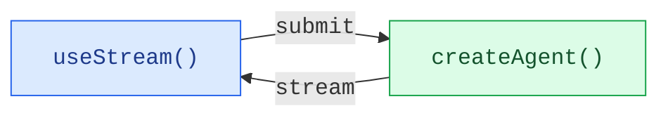
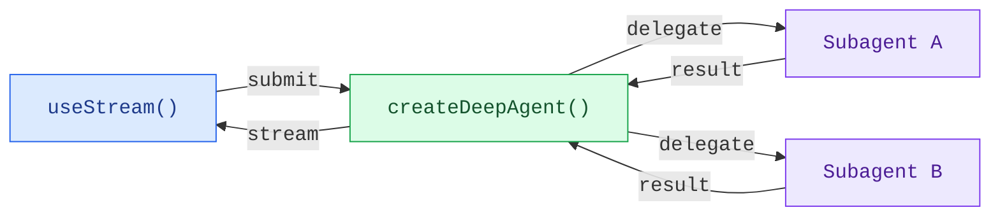

Build rich, interactive frontends for agents. Use `createAgent` for single-agent workflows or `createDeepAgent` for coordinator-worker architectures with subagents. Both stream state to the frontend via the `useStream` hook.

<Tabs default="LangChain">
<Tab title="LangChain">

Build frontends for agents created with `createAgent`. These patterns cover everything from basic message rendering to advanced workflows like human-in-the-loop approval and time travel debugging.

## Architecture

Every pattern follows the same architecture: a `createAgent` backend streams state to a frontend via the `useStream` hook.



On the backend, `createAgent` produces a compiled LangGraph graph that exposes
a streaming API. On the frontend, the `useStream` hook connects to that API
and provides reactive state, including messages, tool calls, interrupts, and
history, that you render with any framework.

<CodeGroup>

:::python
```python agent.py
from langchain import create_agent
from langgraph.checkpoint.memory import MemorySaver

agent = create_agent(
    model="openai:gpt-5.4",
    tools=[get_weather, search_web],
    checkpointer=MemorySaver(),
)
```

```ts types.ts
export interface GraphState {
  messages: BaseMessage[];
}
```

```tsx Chat.tsx
import { useStream } from "@langchain/react";
import type { GraphState } from "./types";

function Chat() {
  const stream = useStream<GraphState>({
    apiUrl: "http://localhost:2024",
    assistantId: "agent",
  });

  return (
    <div>
      {stream.messages.map((msg) => (
        <Message key={msg.id} message={msg} />
      ))}
    </div>
  );
}
```

:::

:::js
```ts agent.ts
import { createAgent } from "langchain";
import { MemorySaver } from "@langchain/langgraph";

const agent = createAgent({
  model: "openai:gpt-5.4",
  tools: [getWeather, searchWeb],
  checkpointer: new MemorySaver(),
});
```

```tsx Chat.tsx
import { useStream } from "@langchain/react";
import type { agent } from "./agent";

function Chat() {
  const stream = useStream<typeof agent>({
    apiUrl: "http://localhost:2024",
    assistantId: "agent",
  });

  return (
    <div>
      {stream.messages.map((msg) => (
        <Message key={msg.id} message={msg} />
      ))}
    </div>
  );
}
```
:::

</CodeGroup>

</Tab>
<Tab title="Deep agents">

Build frontends that visualize deep agent workflows in real time. These patterns show how to render subagent progress, task planning, and streaming content from agents created with `createDeepAgent`.

## Architecture

Deep agents use a coordinator-worker architecture. The main agent plans tasks and delegates to specialized subagents, each running in isolation. On the frontend, `useStream` surfaces both the coordinator's messages and each subagent's streaming state.



:::python

```python
from deepagents import create_deep_agent

agent = create_deep_agent(
    tools=[get_weather],
    system_prompt="You are a helpful assistant",
    subagents=[
        {
            "name": "researcher",
            "description": "Research assistant",
        }
    ],
)
```

:::

:::js

```ts
import { createDeepAgent } from "deepagents";

const agent = createDeepAgent({
  tools: [getWeather],
  system: "You are a helpful assistant",
  subagents: [
    {
      name: "researcher",
      description: "Research assistant",
    },
  ],
});
```

:::

On the frontend, connect with `useStream` the same way as with `createAgent`. Deep agent patterns use additional `useStream` features like `stream.subagents`, `stream.values.todos`, and `filterSubagentMessages` to render subagent-specific UIs.

```ts
import { useStream } from "@langchain/react";

function App() {
  const stream = useStream<typeof agent>({
    apiUrl: "http://localhost:2024",
    assistantId: "agent",
  });

  // Deep agent state beyond messages
  const todos = stream.values?.todos;
  const subagents = stream.subagents;
}
```

</Tab>
</Tabs>

`useStream` is available for React, Vue, Svelte, and Angular:

```ts
import { useStream } from "@langchain/react";   // React
import { useStream } from "@langchain/vue";      // Vue
import { useStream } from "@langchain/svelte";   // Svelte
import { useStream } from "@langchain/angular";  // Angular
```

## Patterns

### Render messages and output

<CardGroup cols={3}>
  <Card title="Markdown messages" icon="markdown" href="/oss/langchain/frontend/markdown-messages">
    Parse and render streamed markdown with proper formatting and code highlighting.
  </Card>
  <Card title="Structured output" icon="layout-grid" href="/oss/langchain/frontend/structured-output">
    Render typed agent responses as custom UI components instead of plain text.
  </Card>
  <Card title="Reasoning tokens" icon="brain" href="/oss/langchain/frontend/reasoning-tokens">
    Display model thinking processes in collapsible blocks.
  </Card>
  <Card title="Generative UI" icon="wand" href="/oss/langchain/frontend/generative-ui">
    Render AI-generated user interfaces from natural language prompts using json-render.
  </Card>
</CardGroup>

### Display agent actions

<CardGroup cols={3}>
  <Card title="Tool calling" icon="tool" href="/oss/langchain/frontend/tool-calling">
    Show tool calls as rich, type-safe UI cards with loading and error states.
  </Card>
  <Card title="Human-in-the-loop" icon="user-check" href="/oss/langchain/frontend/human-in-the-loop">
    Pause the agent for human review with approve, reject, and edit workflows.
  </Card>
</CardGroup>

### Manage conversations

<CardGroup cols={3}>
  <Card title="Branching chat" icon="git-branch" href="/oss/langchain/frontend/branching-chat">
    Edit messages, regenerate responses, and navigate conversation branches.
  </Card>
  <Card title="Message queues" icon="list-check" href="/oss/langchain/frontend/message-queues">
    Queue multiple messages while the agent processes them sequentially.
  </Card>
</CardGroup>

### Advanced streaming

<CardGroup cols={3}>
  <Card title="Join & rejoin streams" icon="plug-connected" href="/oss/langchain/frontend/join-rejoin">
    Disconnect from and reconnect to running agent streams without losing progress.
  </Card>
  <Card title="Time travel" icon="history" href="/oss/langchain/frontend/time-travel">
    Inspect, navigate, and resume from any checkpoint in the conversation history.
  </Card>
</CardGroup>

### Deep agent patterns

<CardGroup cols={3}>
  <Card title="Subagent streaming" icon="arrows-split" href="/oss/deepagents/frontend/subagent-streaming">
    Display specialist subagents with streaming content, progress tracking, and collapsible cards.
  </Card>
  <Card title="Todo list" icon="list-check" href="/oss/deepagents/frontend/todo-list">
    Track agent progress with a real-time todo list synced from agent state.
  </Card>
</CardGroup>
